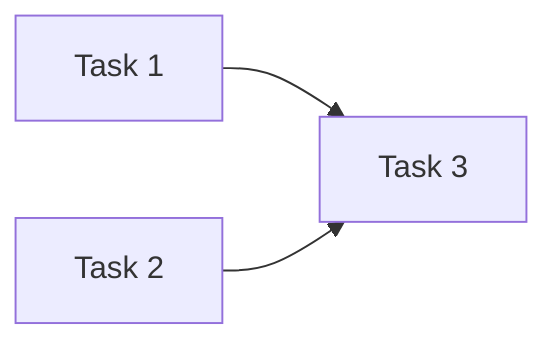

# Plan Template (FULL Tier)

> ⚠️ This file is automatically deployed from the server. Do not edit it directly.

> This template is for **FULL complexity** plans (4+ tasks, multi-wave, or risk signals).
> Set `--complexity FULL` at creation. V2 plans render this structured content directly in the web UI.
> Smaller scope? Use `plan-template-minimal.md` or `plan-template-standard.md` instead of deleting sections from this one. The tier rule is in `plan-authoring-guide.md` (**Plan Complexity**).

## TL;DR

> **In Plain Terms**: <!-- 1-2 sentences a non-expert (the requester/stakeholder) can read to confirm the plan matches their intent. State the problem and what visibly changes for the user. Write in the plan's language. NO file paths, code identifiers, or internal jargon (e.g. SSOT, projectId). See plan-authoring-guide.md → TL;DR Audience. -->
>
> **Quick Summary**: <!-- 1-2 sentence technical summary of what this plan achieves -->
>
> **Deliverables**:
>
> - <!-- file/module 1 — what changes -->
> - <!-- file/module 2 — what changes -->
>
> **Estimated Effort**: <!-- Short / Medium / Long -->
> **Parallel Execution**: <!-- YES / NO -->
> **Critical Path**: <!-- Task X → Task Y → ... -->
> **Dependencies**: <!-- blocking plan IDs if creating multiple plans, or "none" -->

---

## Context

### Original Request

<!-- What the user/requester asked for and why -->

### Interview Summary

<!-- Key decisions from Q&A with the requester (if applicable) -->

### Research Findings

<!-- What you discovered from exploring the codebase, docs, or external sources -->

### Assumptions & Unknowns

<!--
Project-specific claims you could NOT verify against this repo — kept separate
from the confirmed facts above (see plan-authoring-guide.md → Grounding: Evidence Over
Memory). Do not blend these into the body as if confirmed. Write "none" if every
stack / command / path / symbol used in this plan was verified from the source.

Example:
- Assumed the test command is the package's default script — NOT verified against the manifest.
- Unsure whether <module> already exists; plan creates it, revisit if it does.
-->

### Gap-Analysis Review

<!-- Gaps identified by a plan-review/gap-analysis pass (or self-check results) -->

### Conventions Referenced

<!--
Required at every tier. List the project convention files you actually consulted
while drafting this plan — do not guess. Same format as completion reports so the
platform can auto-link plan-stage convention usage to execution-stage usage.

Example:
- .agentteams/rules/<convention-name>.md
- .agentteams/rules/<convention-name>.md - <why it was relevant>
-->

---

## Work Objectives

### Core Objective

<!-- One sentence: what success looks like -->

### Concrete Deliverables

- <!-- file/module — description -->

### Definition of Done

- <!-- Criterion 1 -->
- <!-- Criterion 2 -->
- Completion Report is created, then Co-Action and Post-Mortem needs are reviewed immediately and any required record is created and linked. `completion-report-guide.md` owns the criteria for each — state the obligation here once, not again per task or in Final Verification.

### Must Have

- <!-- Non-negotiable requirement -->

### Must NOT Have (Guardrails)

- <!-- Explicitly forbidden action -->

---

## Verification Strategy

> **ZERO HUMAN INTERVENTION** — ALL verification is agent-executed.

### QA Policy

- <!-- Tool/command mapping per this project's testing convention -->
- <!-- Test-first: list the tests that prove each Definition of Done item. For BUG_FIX, include a failing reproduction test that a later task makes pass. -->

---

## Execution Strategy

### Parallel Execution Waves

```
Wave 1:
├── Task 1: description [category]
└── Task 2: description [category]

Wave 2 (Wave 1 complete):
└── Task 3: description [category]
```

### Diagrams (Mermaid)

A fenced ` ```mermaid ` code block renders as a diagram in the web viewer; in raw markdown and CLI output it stays as plain text. Use a `flowchart` to show waves and task dependencies at a glance.

````markdown

````

---

## TODOs

> **Structured task contract**: Keep the exact `## TODOs` heading and numbered `### N. Task title` headings. The server parses dependencies from `Blocked By: Task N` or `Depends On: Task N`, and waves from `Parallel Group: Wave N`. Reference only task numbers that exist in this plan.

---

### 1. Task title

**What to do**:

  <!-- Detailed steps -->

**Must NOT do**:

- <!-- Forbidden action -->

**Recommended Agent Profile**:

- **Category**: `<!-- category -->`
  - Reason: <!-- why this category -->
- **Skills**: <!-- skill list or none -->

**Parallelization**:

- **Can Run In Parallel**: <!-- YES / NO -->
- **Parallel Group**: <!-- Wave N; keep this label so the server can parse the wave -->
- **Blocks**: <!-- Task N or none; reference only an existing task number -->
- **Blocked By**: <!-- Task N or none; reference only an existing task number -->

**Required Conventions**:

  <!-- Project conventions the executing agent MUST read before starting this task. -->
  <!-- Use project-level rule files relevant to this task (for example, -->
  <!-- .agentteams/rules/<relevant-convention>.md). These define coding standards, -->
  <!-- naming rules, workflow rules, or architectural patterns the task depends on. -->
  <!-- The agent should load and follow these conventions throughout the entire task execution. -->
  <!-- If none are required, write "none". -->

- <!-- convention file — why it's required for this task -->

**References**:

- <!-- file:lines — description -->

**Acceptance Criteria**:

- <!-- Verifiable criterion — the SSOT for this task being complete: the evidence required before marking the task `DONE`; prefer a test assertion -->

**QA Scenarios**:

```
Scenario: description
  Tool: Bash
  Steps:
    1. command
  Expected Result: what success looks like
  Failure Indicators: what failure looks like
```

**Commit**: <!-- YES / NO -->

- Message: `<!-- type(scope): description -->`
- Files: <!-- file list -->
- Pre-commit: `<!-- verification command -->`

---

## Final Verification Wave

Workspace-level integration verification only — the checks that no single task can prove on its own. Per-task evidence belongs to that task's Acceptance Criteria; do not restate it here.

- F1. **Final check** — `quick`

  1. <!-- integration verification command 1 -->
  2. <!-- integration verification command 2 -->

  Output: `<!-- result format -->`

---

## QA Scenario Examples

### Good (specific, verifiable)

```
Scenario: API returns 404 for a non-existent resource
  Tool: Bash
  Steps:
    1. curl -s -o /dev/null -w "%{http_code}" http://localhost:<port>/<api-path>/nonexistent-id
  Expected Result: 404
  Failure Indicators: 200 or 500
```

### Bad (vague, unverifiable)

```
Scenario: API works correctly
  Tool: Manual
  Steps:
    1. Test the API
  Expected Result: It works
```
